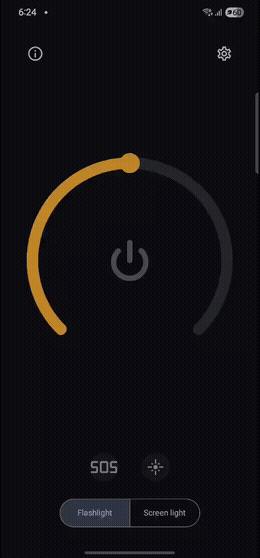
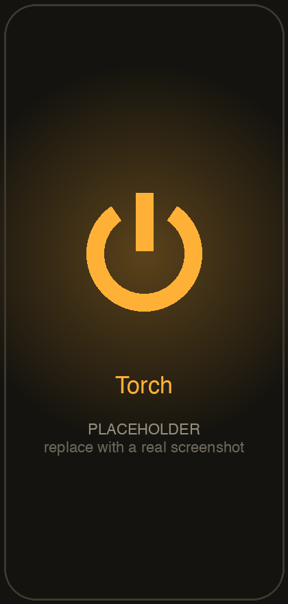
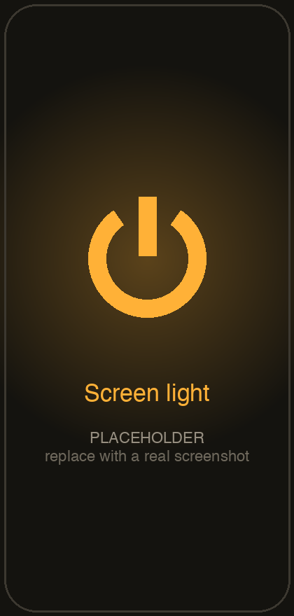
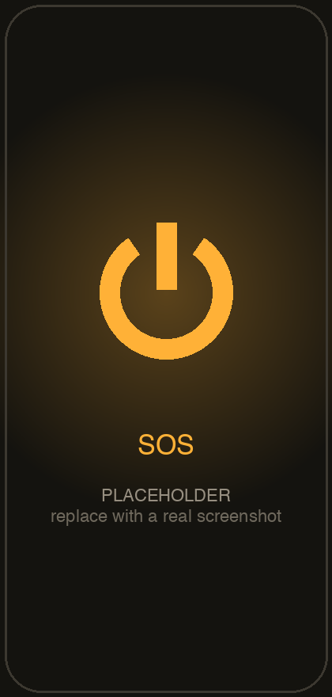
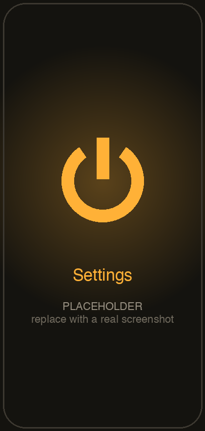

# Flashy

A simple, modern flashlight for Android. Use the camera torch or turn the whole screen into a
colored light, with SOS Morse and stroboscope modes. Built with Jetpack Compose and Material 3.

## Demo

<p align="center">
  
</p>

| Torch | Screen light | SOS | Settings |
| :---: | :---: | :---: | :---: |
|  |  |  |  |

> The images above are placeholders — see [`screenshots/README.md`](screenshots/README.md) for the
> one-command recipe to capture real device footage and drop it in.

## Features

- **Camera torch** with brightness control on supported devices (Android 13+).
- **Screen light** in any color — four presets plus a custom HSV color picker — with a brightness dial.
- **SOS** Morse-code signalling with configurable words-per-minute and optional Farnsworth timing.
- **Stroboscope** with an adjustable interval.
- Light / dark / system themes with Material 3 dynamic color.
- Localized into 29 languages.

## Architecture

Single `:app` module, MVVM, package-by-feature:

```
app/                application entry point, MainActivity, root Navigation 3 graph
core/
  torch/            TorchController abstraction + CameraManager implementation
  morse/            pure Morse-timing maths (MorseTimer)
  dispatchers/      coroutine dispatcher qualifiers + module
  datastore/        UserSettings + PreferencesDataSource (DataStore)
  data/             SettingsRepository
  base/             BaseViewModel (loading + toast)
  navigation/       Navigator / NavigationState (Navigation 3)
  ui/theme, ui/components   FlashyTheme + CircularSlider, PowerButton,
                            ColorSwatchRow, HsvColorPicker
domain/             FlashEngine — coroutine-based torch orchestrator
features/
  flashlight/  settings/  about/   each: Route + Screen + ViewModel + navigation
```

**Stack:** Kotlin · Jetpack Compose · Material 3 · Hilt · Navigation 3 · DataStore · Coroutines/Flow.
Tests use JUnit, Truth, and Turbine.

Design notes:

- `FlashEngine` orchestrates the torch with cancellable coroutine jobs; the torch/SOS/stroboscope
  modes are mutually exclusive and the torch is always turned off when a job is cancelled.
- `CircularSlider` (a Canvas arc slider) and `HsvColorPicker` are custom Composables — no UI
  dependencies beyond Compose itself.
- `TorchController` is an interface, so `FlashEngine` is unit-tested against a fake — no device needed.

## Build & test

```bash
./gradlew :app:assembleDebug     # build the debug APK
./gradlew testDebugUnitTest      # run unit tests
./gradlew spotlessApply          # format (ktlint via Spotless)
./gradlew spotlessCheck          # verify formatting (also enforced in CI)
```

Requirements: JDK 17, Android SDK 36, `minSdk` 24.

## License

Apache License 2.0.

Inspired by the original open-source [Flashy](https://github.com/CrazyMarvin/Flashy) (Apache 2.0).
